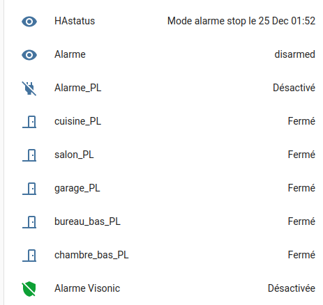

[](https://github.com/custom-components/hacs)

## Powerlink2

create sensor and binary_sensor to interact with a visonic alarm using the mqtt protocol

 - [see README.md](README.md) 

## Usage:

- Add to configuration.yaml:

```
alarm_control_panel:
  - platform: mqtt
    state_topic: homeassistant/alarm
    command_topic: homeassistant/alarm/set
    payload_disarm: Disarm
    payload_arm_home: ArmHome
    payload_arm_away: ArmAway
    name: Alarme Visonic
```

- Add to the sensors.yaml file (in the configuration.yaml I use `sensor: !include sensors.yaml`) insert the configuration of the powerlink2 sensor as

```
  - platform: powerlink2
    state_topic: homeassistant/alarm
    command_topic: homeassistant/alarm/set
    sensor_topic: homeassistant/alarm/sensor
    sensor_battery_topic: homeassistant/alarm/sensorbattery
    host: !secret alarm_host
    scan_interval: 1
    ignore_first_cmd: True
    alarm_user: !secret alarm_user
    alarm_password: !secret alarm_password
```

- Add to the mqtt.yaml file (in the configuration.yaml I use `mqtt: !include mqtt.yaml`) insert the mqtt sensors you want to use

```
# mqtt sensor
  sensor:
    - name: HAstatus 
      state_topic: "homeassistant/status"
    - name: Alarme
      state_topic: "homeassistant/alarm"
    - name: AlarmSensor 
      state_topic: "homeassistant/alarm/sensor"
# mqtt binary_sensor
  binary_sensor:
    - name: Alarme_PL
      state_topic: "homeassistant/alarm"
      payload_on: "armed_away"
      payload_off: "disarmed" 
      device_class: power 
    - name: cuisine_PL
      state_topic: "homeassistant/alarm/sensor5"
      payload_on: "Ouv."
      payload_off: "Ok"
      device_class: door
    - name: salon_PL
      state_topic: "homeassistant/alarm/sensor6"
      payload_on: "Ouv."
      payload_off: "Ok"
      device_class: door 
```

The following image show an exemple of the visonic2 interface on home-assistant




  
